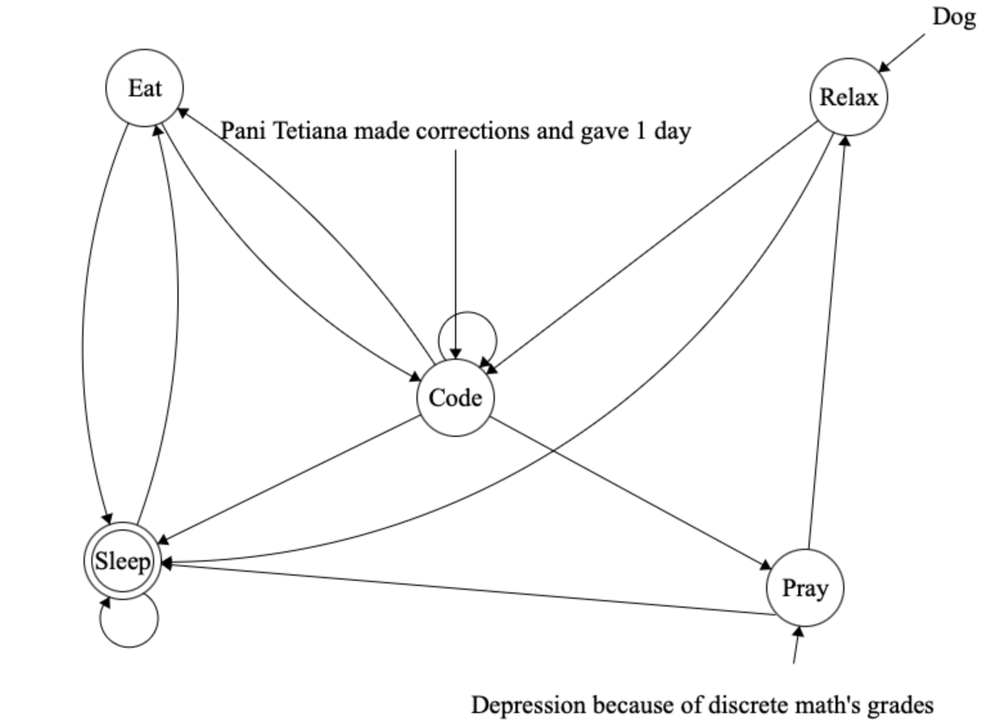
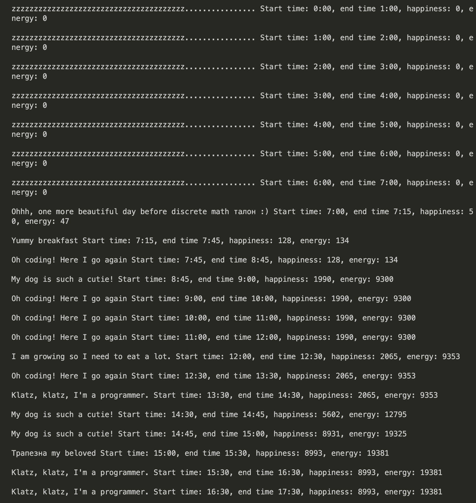
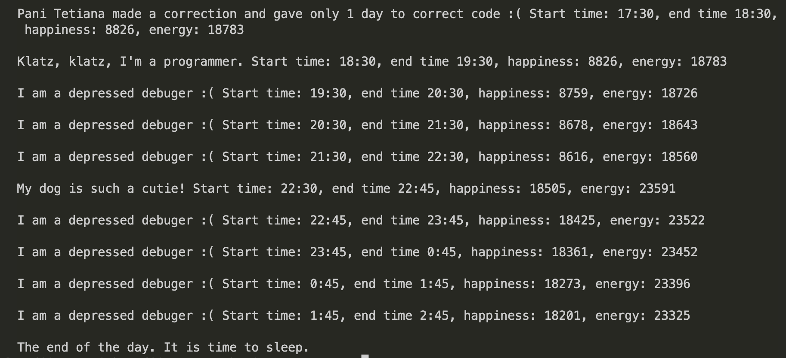

# FiniteAutomata

## Diagrama



The example of using it
```
from finite_autumata import LifeAutomata

simulation = LifeAutomata()
simulation.simulate_day()
```
To run it do
```
git clone https://github.com/SofiiaPop/FiniteAutomata
cd FiniteAutomata
python3 -m src
```
the example of by_hour output



